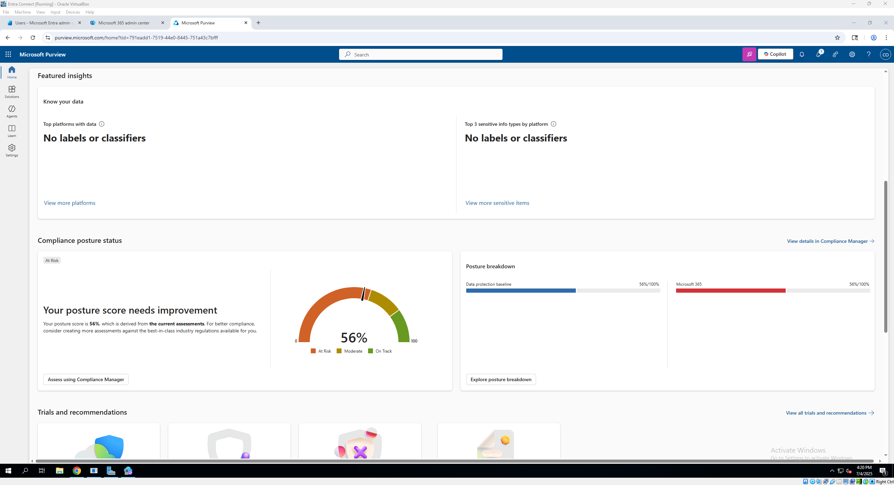
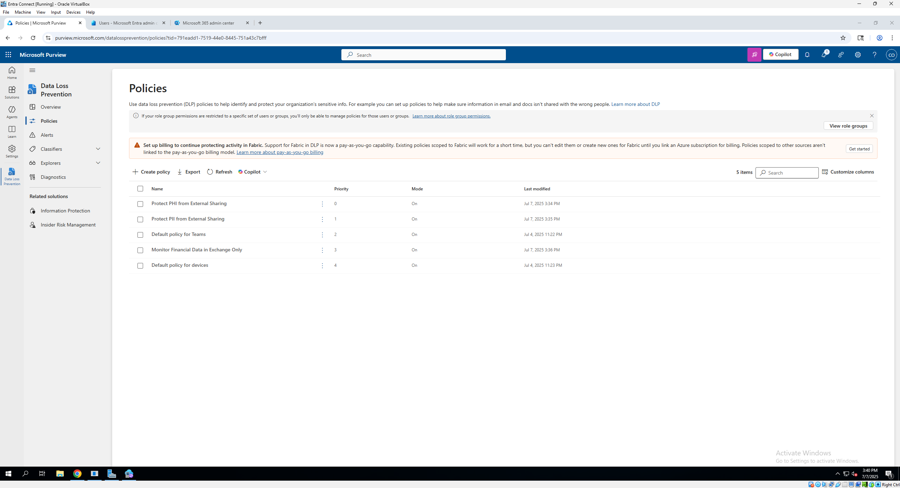
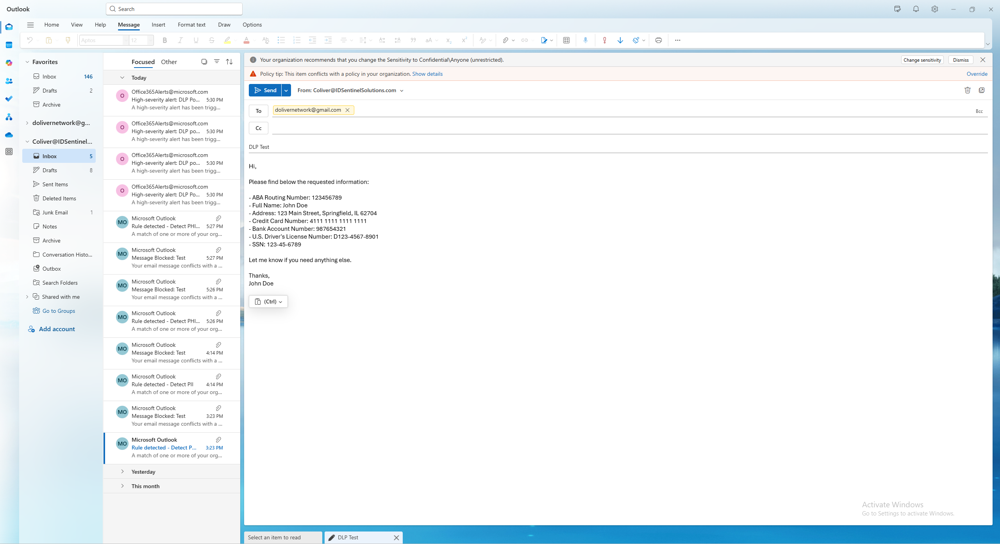
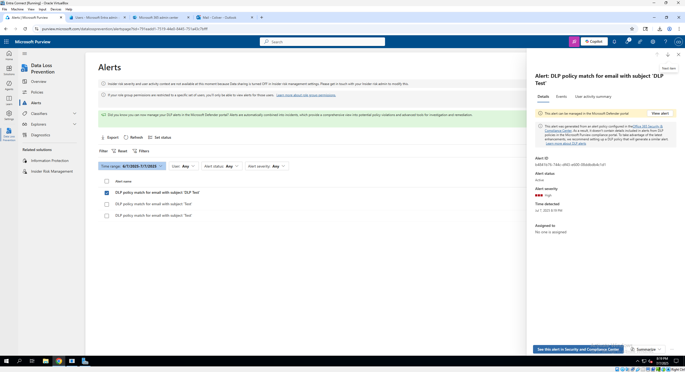
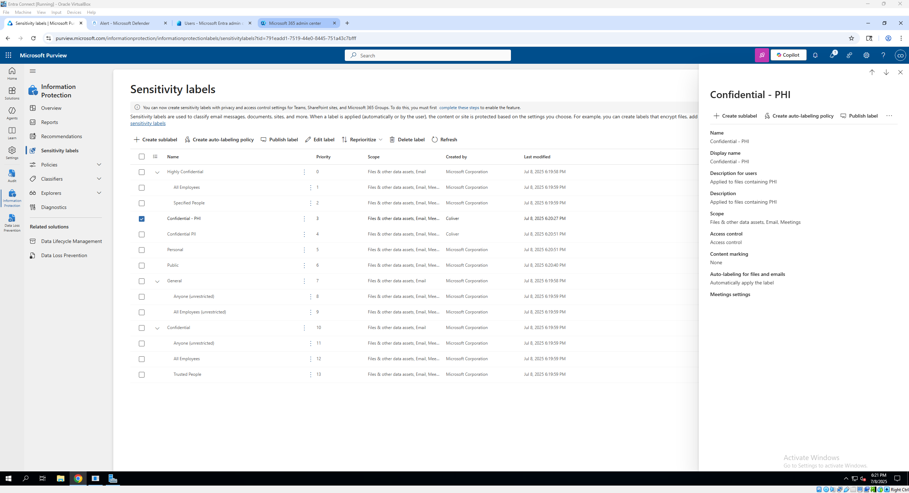
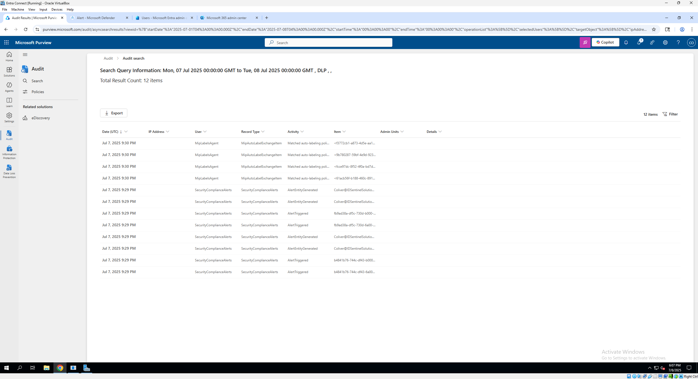

# Microsoft Purview Data Loss Prevention (DLP) Lab

This project showcases a hands-on lab where I configured and tested **Microsoft Purview's Data Loss Prevention (DLP)** capabilities. The goal was to create, deploy, and validate a DLP policy protecting sensitive data within Microsoft 365, with alerts surfaced across **Purview**, **Defender for Cloud Apps**, and **audit logs**.

---

## 🔍 Lab Objectives
- Deploy a **DLP policy** to detect sensitive data types in outbound email.
- Validate policy enforcement with a real-world test scenario.
- Review resulting **alerts**, **audit logs**, and **sensitivity labels**.

---

## ⚙️ Tools Used
- Microsoft Purview Compliance Portal
- Microsoft Defender Portal
- Microsoft 365 Admin Center
- Exchange Online (Mail Flow)

---

## 📸 Key Screenshots

### ✅ Compliance Portal Overview: This is the Microsoft Purview Compliance Portal home page where DLP policies, labels, and alerts are managed.  

### ✅ DLP Policy List: A list of configured DLP policies within Microsoft Purview, showing active protection for sensitive data types.

### ✅ DLP Policy Summary: Summary of the configured DLP policy protecting PHI and PI

### ✅ Example Trigger-Email with Sensitive Info: A test email containing sensitive data that triggers the DLP policy.

### ✅ DLP Alert in Microsoft Purview: The generated DLP alert visible in the Purview portal after the policy is triggered.

### ✅ Sensitivity Labels Example: Configured sensitivity labels, including Confidential PII, PHI and sublabels 

### ✅ Audit Log Example: Audit log entry recording the DLP policy trigger event and email action.

---

## 📂 Full Workflow Walkthrough

See the [full DLP policy creation and testing walkthrough](docs/dlp-walkthrough.md) for step-by-step screenshots, including:
- Creating a DLP policy
- DLP rule configuration
- Sending a test email
- Reviewing alerts in Purview and Defender
- Verifying audit logs

---

## 🔑 Key Takeaways
- DLP policies in Microsoft 365 can detect and block sensitive data in transit.
- Alerts integrate seamlessly with Purview and Defender for Cloud Apps.
- Audit logs provide traceability of policy actions.

---

## 🚀 Next Steps
- Expand testing to SharePoint and OneDrive data loss prevention.
- Automate policy deployment with Microsoft Graph or PowerShell.
- Integrate additional sensitivity labels and auto-labeling policies.

---

## 👨‍💻 Author
Cleveland Oliver

---

