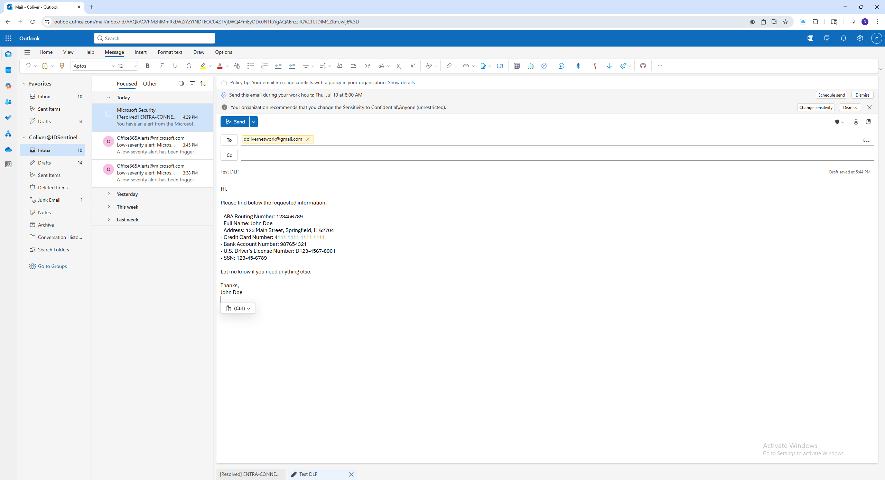

# Microsoft Purview Data Loss Prevention (DLP) Lab

This project showcases a hands-on lab where I configured and tested **Microsoft Purview's Data Loss Prevention (DLP)** capabilities. The process began by creating and publishing **Sensitivity Labels** to classify sensitive data such as PHI and PII. Then, I created, deployed, and validated a DLP policy that protects this sensitive data within Microsoft 365, with alerts surfaced across **Purview**, **Defender for Cloud Apps**, and **audit logs**.

---

## 🔍 Lab Objectives
- Create and publish **Sensitivity Labels** to classify sensitive information like Protected Health Information (PHI) and Personally Identifiable Information (PII).  
- Deploy a **DLP policy** to detect and protect sensitive data types in outbound email using these labels.  
- Validate policy enforcement with a real-world test scenario.  
- Review resulting **alerts**, **audit logs**, and **label classifications**.

---

## ⚙️ Tools Used
- Microsoft Purview Compliance Portal  
- Microsoft Defender Portal  
- Microsoft 365 Admin Center  
- Exchange Online (Mail Flow)

---

## 📸 Key Screenshots

### ✅ Compliance Portal Overview  
This is the Microsoft Purview Compliance Portal home page where DLP policies, labels, and alerts are managed.  

### ✅ Sensitivity Labels Example  
Configured sensitivity labels, including **Confidential** with sublabels for PHI and PII, defining classifications for protected health and personal information.  

### ✅ DLP Policy List  
A list of configured DLP policies within Microsoft Purview, showing active protection for sensitive data types.  

### ✅ DLP Policy Summary  
Summary of the configured DLP policy protecting PHI and PII data.  

### ✅ Example Trigger-Email with Sensitive Info  
A test email containing sensitive data that triggers the DLP policy.  

### ✅ DLP Alert in Microsoft Purview  
The generated DLP alert visible in the Purview portal after the policy is triggered.  

### ✅ Audit Log Example  
Audit log entry recording the DLP policy trigger event and email action.  

---

## 📂 Full Workflow Walkthrough

See the [full DLP policy creation and testing walkthrough](docs/dlp-walkthrough.md) for step-by-step screenshots and instructions, including:  
- Creating and publishing Sensitivity Labels  
- Creating a DLP policy  
- Configuring DLP rules  
- Sending a test email  
- Reviewing alerts in Purview and Defender  
- Verifying audit logs

---

## 🔑 Key Takeaways
- Sensitivity labels enable consistent classification and protection of sensitive data.  
- DLP policies in Microsoft 365 can detect and block sensitive data in transit based on labels and content.  
- Alerts integrate seamlessly with Purview and Defender for Cloud Apps.  
- Audit logs provide traceability of policy actions.

---

## 🚀 Next Steps
- Expand testing to SharePoint and OneDrive data loss prevention.  
- Automate policy deployment with Microsoft Graph or PowerShell.  
- Integrate additional sensitivity labels and auto-labeling policies.

---

## 👨‍💻 Author  
Cleveland Oliver

---
