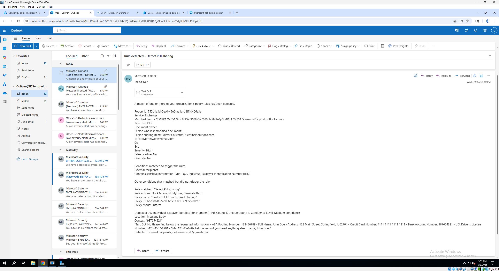

# Data Loss Prevention (DLP) Policy Walkthrough

This walkthrough documents the process of creating, configuring, testing, and verifying a Microsoft Purview DLP policy to protect sensitive data such as PHI and PII. The full workflow includes creating **Sensitivity Labels**, deploying a **DLP Policy**, and reviewing the results across alerts and audit logs.

---

## 1. Creating Sensitivity Labels

1. Sign in to the [Microsoft Purview Compliance Portal](https://purview.microsoft.com/).
2. Navigate to **Information protection** > **Labels**.
3. Create a new **parent label** called "Confidential" (or your preferred name).
4. Add **sublabels** for "PHI – Protected Health Information" and "PII – Personally Identifiable Information."
5. Configure the label scope (Exchange email, SharePoint, and OneDrive).
6. (Optional) Configure encryption, content marking, and auto-labeling as needed.
7. Publish the sensitivity labels by creating a **Label Policy** that assigns the labels to user groups or your tenant.

➡️ **Screenshots:**
- Sensitivity Labels List  
  

- Create Label – Basics (Name & Description)  
  

- Label Scope (Exchange, SharePoint, OneDrive)  
  

- Encryption and Marking Configuration (if configured)  
  

- Publish Label Policy  
  

---

## 2. Creating a DLP Policy

1. In the [Microsoft Purview Compliance Portal](https://purview.microsoft.com/), navigate to **Data loss prevention** > **Policies**.
2. Click **Create policy**.
3. Choose **Custom policy** or use a **template** that fits your use case (e.g., HIPAA or Financial).
4. Name your policy (e.g., "PHI and PII Protection") and add a description.
5. Select the locations to apply the policy (e.g., Exchange email, SharePoint, OneDrive).
6. Proceed to configure rules in the next step.

➡️ **Screenshots:**
- Choose Template  
  

- Choose Locations  
  

- Conditions  
  

- Actions & Alerts  
  

- Define Policy Settings  
  

- Policy Mode  
  

- Review & Finish  
  

- Creation Success  
  

---

## 3. DLP Rule Configuration

1. Add a rule within the policy.
2. Define conditions to detect sensitive info types such as:
   - Protected Health Information (PHI)
   - Personally Identifiable Information (PII)
3. Set actions to take when content matches the rule, for example:
   - Block email from sending
   - Notify users with a policy tip
   - Generate incident reports and alerts
4. Customize exceptions if needed (e.g., allow emails from specific users).
5. Review and save the rule.

➡️ **Screenshots:**
Refer to the screenshots from the DLP Policy creation wizard (Step 2) where the rule conditions and actions were configured.

---

## 4. Sending a Test Email

1. From a mailbox in your tenant, compose an email containing sensitive information that matches your DLP policy rules (e.g., a sample Social Security Number or medical info).
2. Send the email to a recipient within your organization or external as your policy allows.
3. If your policy is set to block or warn, verify the behavior accordingly.

➡️ **Screenshots:**
- Test Email with Sensitive Info  
  

- DLP Block Message (if applicable)  
  

- DLP Block Message Email (if applicable)
  

---

## 5. Reviewing Alerts in Purview and Defender

1. Return to the **Microsoft Purview Compliance Portal**.
2. Navigate to **Alerts** or **Incidents** under the DLP section.
3. Find alerts triggered by your test email.
4. Review details such as user, time, content detected, and policy actions.
5. For Defender for Cloud Apps integration:
   - Open the Defender portal.
   - Navigate to **Alerts** and verify related incidents from the DLP policy.
6. Use these alerts to monitor and investigate data loss events.

➡️ **Screenshots:**
- DLP Alert in Purview  
  

- Admin Email Notification  
  

- DLP Alert in Defender for Cloud Apps  
  

---

## 6. Verifying Audit Logs

1. In Microsoft Purview, go to **Audit** or use the **Microsoft 365 Security & Compliance Center**.
2. Search for audit events related to DLP policy triggers.
3. Filter by date, user, or event type as needed.
4. Confirm that the test email's policy match and enforcement actions are logged.
5. Use audit logs for compliance reporting and forensic analysis.

➡️ **Screenshot:**
- Audit Log Entry  
  

---

## Additional Notes

- You can enhance your DLP policies by integrating sensitivity labels for automatic classification.
- Automate alert handling via Power Automate or third-party tools.
- Regularly review and update DLP policies to keep pace with organizational and regulatory changes.

---

## Screenshots Reference

Refer to the `/Screenshots` folder for visuals corresponding to each step.

---

## 🔧 Troubleshooting & Lessons Learned

During the lab, I encountered a few common configuration gaps:

- **Audit Logging Disabled by Default:**  
   I initially couldn’t find DLP events in the audit logs. I resolved this by enabling auditing in the Microsoft Purview Compliance portal under Audit settings.

- **Defender Alerts Not Appearing:**  
   I noticed my DLP alerts didn’t show in Microsoft Defender for Cloud Apps. I resolved this by configuring an alert policy in Defender and verifying that alert forwarding from Purview was enabled.

These troubleshooting steps helped reinforce the importance of validating your security stack end-to-end, not just at the policy level.

---

## 👨‍💻 Author  
Cleveland Oliver

---
